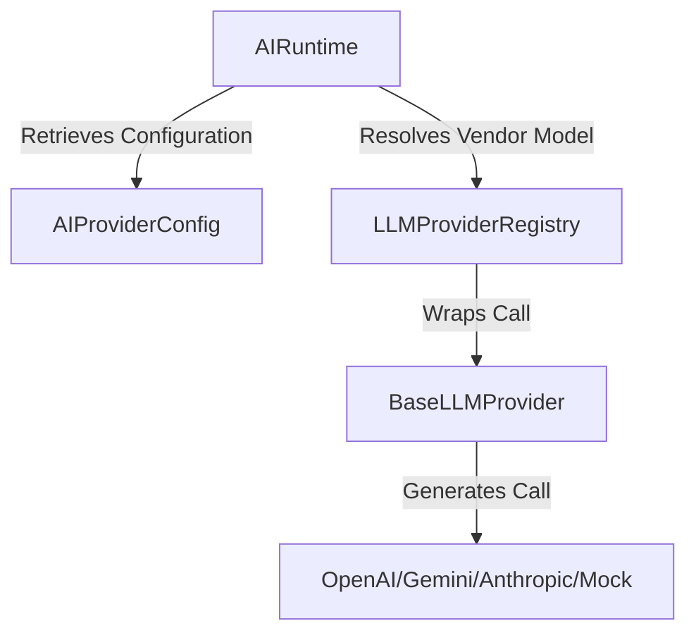

# ADR-010: AI Runtime Foundation

## Status
APPROVED

## Context
HireAI is transitioning from a traditional SaaS CRM to an agentic automation platform. Future sprints (Sprint 5B - Memory & Knowledge, Sprint 5C - AI Sales Executive) require a multi-tenant, reliable, and auditable runtime engine to compile prompts, run LLM vendor calls, execute business tools, and safely control iteration loop depths.

## Proposed Architecture

### 1. Database Model Definitions
We introduce the following core tables to the relational database:
*   `ai_provider_configs`: Organization-scoped credentials and connection details for vendor platforms (e.g. OpenAI, Anthropic, Gemini, Mock).
*   `ai_agents`: Configuration parameters defining agent behavior, including system prompt templates, role, temperature, max tokens, and active provider configurations.
*   `ai_prompts`: Versioned templates for prompt generation with variable compile checks and optimistic locking protections.
*   `ai_conversations`: Tracks conversational state, runtime execution phases, input/output tokens, total latency, and stores snapshot snapshots of the agent settings utilized for reproducibility.
*   `ai_messages`: Records conversation history (User, Assistant, System, and Tool messages) with latency and token details.
*   `ai_tool_executions`: Immutable audit trail tracing tool calls, execution success/failure states, parameters, and output results.
*   `ai_prompt_executions`: Diagnostic compiling log containing compiler output prompts, version hashes, and resolved variables.

### 2. Provider Abstraction
We define a standard `BaseLLMProvider` protocol interface to wrap vendor APIs. Concrete wrappers are built for `OpenAIProvider`, `AnthropicProvider`, `GeminiProvider`, and `MockLLMProvider`. A centralized registry maps these providers to standard execution endpoints.

### 3. Execution Pipeline & Tool Integration
The runtime exposes a standard loop executing LLM calls recursively when the provider returns a requested tool invocation:
1.  **State Initialization**: Set state to `PROMPT_BUILD` and render dynamic system prompts replacing `{{organization.name}}`, `{{lead.*}}` or `{{user.*}}` variables.
2.  **Context Builder**: Collect last 20 messages matching sliding window bounds and compile inputs.
3.  **LLM Call**: Set state to `LLM_CALL`, execute prompt payload generation.
4.  **Tool Execution**: Validate parameters and invoke local domain handlers (e.g., `LeadTool`) using JSON schema checks. Set state to `TOOL_EXECUTION`. Record execution metrics under `ai_tool_executions`.
5.  **Infinite Loop Protection**: Track tool execution depths. If iteration limits are reached (default = 5), trigger a fail-safe abort and raise an exception.
6.  **Resolution**: Commit final assistant summaries and aggregate token metric usage.

## Consequences
*   **Auditability**: Complete transparency over prompt versions, compiler parameters, and tool metrics.
*   **Security**: Rigid tenant isolation prevents organizations from accessing or querying provider configs, agents, or templates owned by other tenants.
*   **Extensibility**: Adding new tools or provider integrations only requires extending standard registries without modifying the core state machine.
