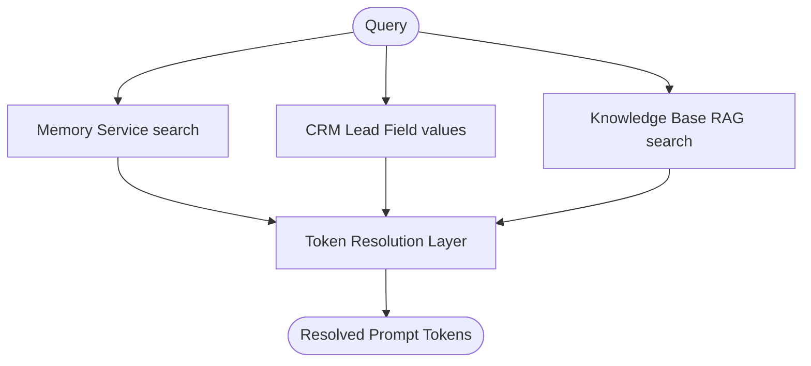

# AI Memory & Retrieval Architecture Guide

This document details the layered RAG context search, vector search, and long-term memory retrieval pipelines of the HireAI platform.

## Memory Layering Strategy

HireAI retrieves contextual variables across multiple database sources to build the LLM's system memory dynamically:

## Retrieval Pipeline

The context assembly is orchestrated by the `RetrievalService` during runtime execution:

### 1. Vector Search & RAG
- Splitting: Files and documents are split into chunks.
- Embeddings: Text chunks are converted to vector embeddings (using configurable provider e.g. OpenAI/Gemini).
- Vector Query: Searches PostgreSQL database (using vector search extensions/libraries) to find text chunks matching query similarity.

### 2. CRM Context Integration
Retrieves lead properties (e.g. status, values, communication history) to prevent hallucinating lead details.

### 3. Layered Token Resolution (`PersonalizationEngine`)
Resolves template variables by priority:
1. Campaign Context variables
2. CRM Lead Fields
3. Organization settings
4. Memory/Knowledge logs
5. Standard default values
