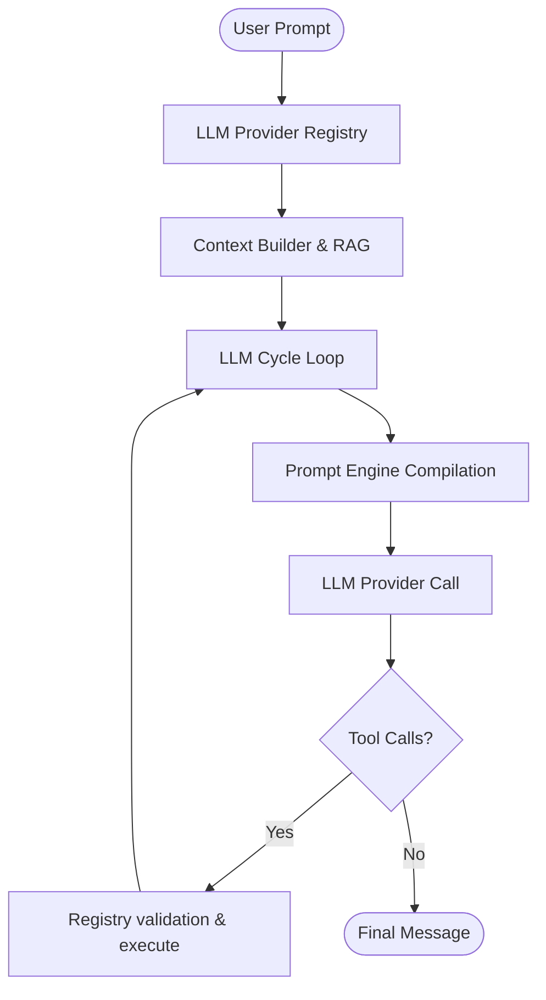

# AI Runtime Architecture Guide

This document details the core execution engine of the HireAI platform that runs the prompt-to-response generation state machine.

## Core Execution Flow

The `AIRuntime` is responsible for taking a user prompt, loading the corresponding agent configuration, assembling context via the `RetrievalService`, invoking the LLM provider, validating outcomes, executing tool calls, and persisting traces.

## Architectural Components

### 1. Provider Registry (`LLMProviderRegistry`)
Provides a standard, multi-provider abstraction over downstream LLM model execution pipelines. Resolves API credentials securely per organization tenant context.

### 2. Tool Registry (`ToolRegistry`)
Maintains a list of executable functions with Pydantic parameter schemas. Validates LLM tool call arguments against function schemas before executing them in the database transaction context.

### 3. Prompt Engine (`PromptEngine`)
Compiles templates by injecting lead, organization settings, and conversation memory details. Computes md5 hashes of system prompt templates to prevent redundant evaluations.

### 4. Runtime State Machine
Tracks active conversation states via `AIRuntimeState` enums:
- `PROMPT_BUILD`
- `LLM_CALL`
- `TOOL_EXECUTION`
- `COMPLETED`

## Passive Observability Integration
The runtime hooks in the `TraceCollector` to record:
- Total execution latency
- Nested span structure (OTel parent/child format)
- Prompt/Completion token metrics and costs
- Tool execution status, duration, and arguments
